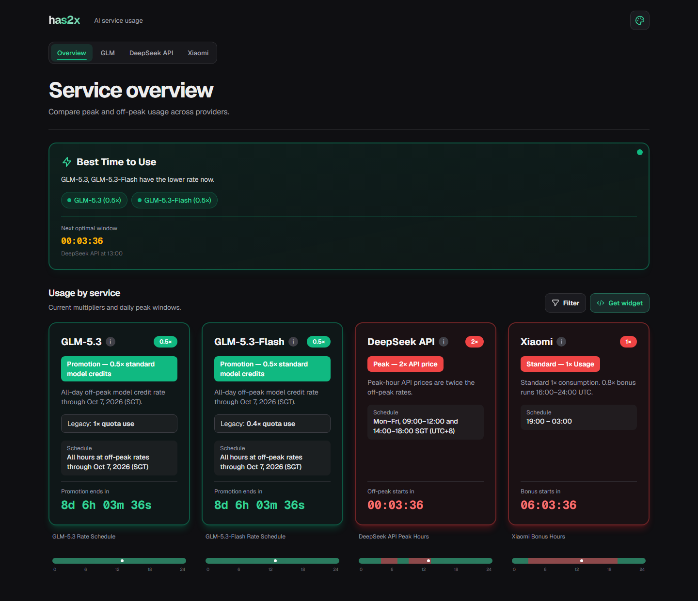

# has2x — AI Usage Multiplier Tracker

has2x shows the rate schedules configured for the GLM Coding Plan, DeepSeek API, and Xiaomi MiMo Token Plan. It calculates the current status and the next scheduled change in your browser. It does not read your provider account, quota balance, or bill.

## Features

- Current rate cards, daily timelines in local time, and countdowns to the next scheduled change.
- A "Best Time to Use" card based on all four tracked services.
- Filters for dashboard cards and a separate service selection for the embeddable widget.
- Provider pages at `/glm`, `/deepseek`, and `/xiaomi`.
- Light and dark modes with Emerald, Sunset, Ocean, and Cyberpunk palettes. Theme choices are saved in the browser.
- Browser-side status calculations. The app does not call provider APIs to obtain live rates or balances.

## Screenshot

The default dark Emerald Overview was captured from the public page in a clean browser profile on September 29, 2026. It contains no account data. Countdown values and rates are a snapshot of that date.

[](docs/images/overview-plain.png)

## Tracked schedules

These are the values currently encoded in [`lib/services.ts`](lib/services.ts), not rates fetched from providers at runtime. Times in this table use the provider's stated timezone; the dashboard timeline uses your browser's local time.

| Service | Scheduled window | Values displayed by the app |
|---------|------------------|-----------------------------|
| GLM-5.3 | Monday–Friday, 14:00–18:00 SGT (UTC+8) | Credit plan: 1× standard model credits at peak, 0.5× off-peak. Legacy display: 3× quota use at peak, 1× off-peak. |
| GLM-5.3-Flash | Monday–Friday, 14:00–18:00 SGT (UTC+8) | Credit plan: 1× standard model credits at peak, 0.5× off-peak. Legacy display: 1.2× quota use at peak, 0.4× off-peak. |
| DeepSeek API | Monday–Friday, 09:00–12:00 and 14:00–18:00 SGT (UTC+8) | Peak API prices are 2× the off-peak prices. |
| Xiaomi MiMo Token Plan | Daily, 16:00–24:00 UTC | 0.8× credit consumption during the bonus window; 1× otherwise. |

The [GLM Coding Plan promotion](https://docs.z.ai/devpack/overview) sets all-day off-peak consumption from September 25 through October 7, 2026. The app applies each plan's off-peak GLM values during that period and resumes regular peak hours on October 8 at 00:00 SGT (October 7 at 16:00 UTC).

### Which GLM plan do the numbers describe?

[Z.AI's current Coding Plan](https://docs.z.ai/devpack/overview) calculates model credit use from input, cached input, and output tokens. It then charges 1× the resulting credits during peak hours or 0.5× off-peak. The published base multipliers are:

| Model | Input | Cached input | Output |
|-------|------:|-------------:|-------:|
| GLM-5.3 | 6.9 | 1.7 | 24 |
| GLM-5.3-Flash | 2.3 | 0.56 | 8 |

Model credits equal `(input tokens × input multiplier + cached input tokens × cached input multiplier + output tokens × output multiplier) / 10,000`, followed by the time-of-day rate. The 0.5× display is a discount on this model-specific credit calculation, not a fixed per-call cost.

[Z.AI's plan update notice](https://docs.z.ai/devpack/notice/usage-revision) publishes the older quota multipliers for Legacy V2 and Team plans. The app uses **Legacy** as a shared label for older V1 and V2 subscriptions and displays the published V2 multipliers. [V1 has no weekly quota limit](https://docs.z.ai/devpack/transition); V2 has one. Z.AI says V1 retains its original calculation method but does not republish its model multipliers in the plan update notice. Check **My Plan** for the terms that apply to your subscription. The app does not identify your plan.

The separate [GLM-5.3-Flash usage campaign](https://docs.z.ai/devpack/overview) can increase available usage in specific tools and hours. This tracker does not model that extra allowance.

The [DeepSeek pricing page](https://api-docs.deepseek.com/quick_start/pricing/) confirms the two weekday peak windows and half-price off-peak rates. Chinese public holidays are also off-peak, but the app has no holiday calendar and may show peak on those dates. [Xiaomi's Token Plan documentation](https://mimo.mi.com/docs/en-US/quick-start/faq/token-plan/Usage%26Quota) describes the 0.8× credit rate during 16:00–24:00 UTC.

## Pages and filtering

| Route | Contents |
|-------|----------|
| `/` | Dashboard, "Best Time to Use" card, service filter, and widget generator. |
| `/glm` | GLM-5.3 and GLM-5.3-Flash status and schedules. |
| `/deepseek` | DeepSeek API status and schedule. |
| `/xiaomi` | Xiaomi MiMo Token Plan status and schedule. |

The "Best Time to Use" card considers all four services even when the dashboard filter hides some cards. On reload, a `services` URL parameter controls the visible cards. Without that parameter, the dashboard currently opens all four cards, even if you filtered them before reloading.

## Widget and URL parameters

| Parameter | Example | Behavior |
|-----------|---------|----------|
| `widget` | `?widget=true` | Shows the compact widget instead of the dashboard. Only the value `true` enables it. |
| `services` | `?services=glm53,deepseek` | Selects the service cards shown on initial load. Unknown keys are ignored. |

Valid service keys are `glm53`, `glm53Flash`, `deepseek`, and `xiaomi`. If `services` is absent or empty, all four services appear. A nonempty value with no valid keys, such as `?services=other`, produces an empty widget or dashboard.

Select **Get widget** on the dashboard to choose services, width, and height, then copy the generated iframe markup. For example:

```html
<iframe src="https://has2x.vercel.app/?widget=true&services=glm53,deepseek" width="100%" height="400px" frameborder="0"></iframe>
```

Replace the domain with your own deployment when self-hosting. The widget's service selection is separate from the dashboard filter.

## Run locally

Use Node.js 20.9 or newer. Install the locked dependencies and start the development server:

```bash
npm ci
npm run dev
```

Open [http://localhost:3000](http://localhost:3000) in your browser.

| Command | Purpose |
|---------|---------|
| `npm run dev` | Start the development server. |
| `npm run build` | Build the production app. |
| `npm run start` | Serve a production build. |
| `npm run lint` | Run ESLint. |
| `npm exec -- vitest run` | Run the existing Vitest tests. |

## Tech stack

- [Next.js 16](https://nextjs.org) — React framework
- [React 19](https://react.dev) — UI library
- [Tailwind CSS 4](https://tailwindcss.com) — Styling
- [TypeScript](https://www.typescriptlang.org) — Type safety
- [Lucide React](https://lucide.dev) — Widget icons

## How status updates work

After the page loads, the browser computes each service's status from the schedules in `lib/services.ts` and refreshes the status data every 30 seconds. The displayed countdowns update separately. The browser's timezone determines the daily timeline and the timezone label in the header. No provider API is queried, so changed pricing or a temporary promotion requires a code update before it appears here.
